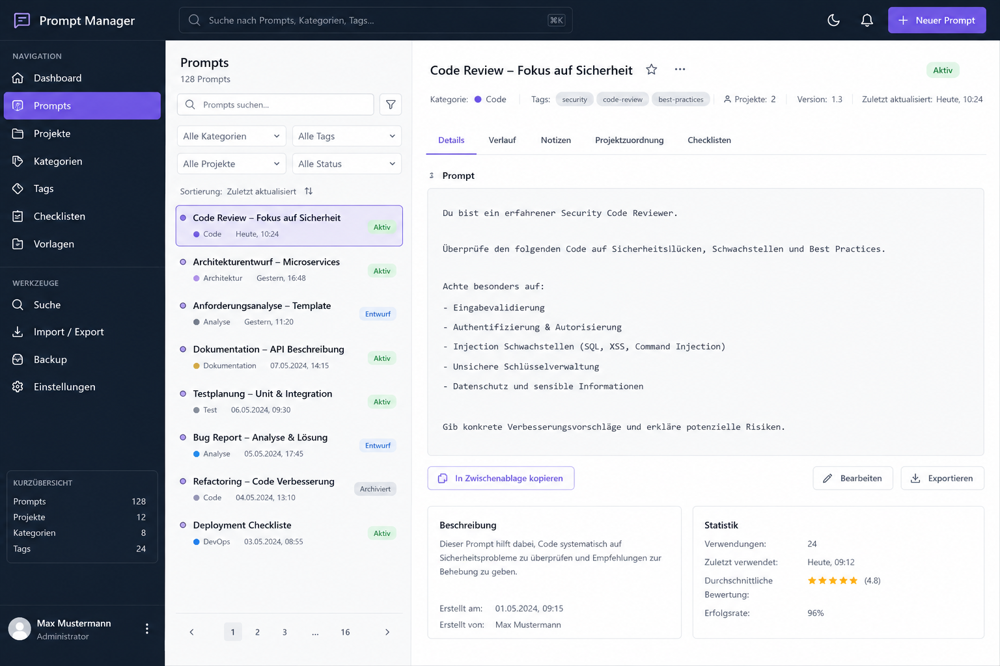

# SASD Prompt Manager

**Professionelle Prompt-Verwaltung für strukturierte Softwareentwicklung, Dokumentation, Analyse und KI-gestützte Arbeitsabläufe.**

SASD Prompt Manager ist eine Anwendung zur Verwaltung, Versionierung, Wiederverwendung und Qualitätssicherung von Prompts. Das Projekt richtet sich an Entwickler, Prompt Engineers, technische Dokumentationsteams und kleine Unternehmen, die Prompts nicht mehr als lose Textbausteine behandeln möchten, sondern als wiederverwendbare, versionierte und nachvollziehbare Arbeitsartefakte.

Die Anwendung soll helfen, wiederkehrende Prompts für Softwareentwicklung, Architektur, Security Reviews, Lastenhefte, Pflichtenhefte, Dokumentation, Codeanalyse und Projektplanung strukturiert zu organisieren und langfristig weiterzuentwickeln.

---

## Screenshot

> Vorläufiger UI-Entwurf für die Prompt-Bibliothek mit Navigation, Suche, Filterung, Promptliste und Detailansicht.



Falls der Screenshot im Repository noch nicht sichtbar ist, sollte die Datei unter folgendem Pfad abgelegt werden:

```text
/docs/screenshots/prompt-manager-dashboard.png
```

---

## Warum dieses Projekt?

In der täglichen Arbeit mit KI entstehen schnell viele ähnliche Prompts: für Code Reviews, Architekturentscheidungen, Dokumentenerstellung, Fehleranalyse, Security Checks oder Projektplanung. Ohne Verwaltung werden diese Prompts oft in alten Chats, Textdateien, Notizen oder Markdown-Sammlungen verstreut abgelegt.

Das führt zu typischen Problemen:

- gute Prompts gehen verloren,
- ähnliche Prompts werden mehrfach neu geschrieben,
- Verbesserungen sind nicht nachvollziehbar,
- bewährte Formulierungen werden nicht konsequent wiederverwendet,
- Projektkontext, Varianten und Ergebnisse bleiben unstrukturiert,
- es fehlt eine Übersicht, welche Prompts wirklich funktionieren.

SASD Prompt Manager soll dieses Problem lösen, indem Prompts ähnlich wie Quellcode behandelt werden: strukturiert, versioniert, dokumentiert, prüfbar und projektbezogen wiederverwendbar.

---

## Zielbild

Das langfristige Ziel ist eine **Prompt Engineering Workbench** für professionelle KI-Nutzung.

Die Anwendung soll zunächst eine solide lokale Prompt-Bibliothek bereitstellen und später zu einer Plattform für Templates, Snippets, Versionierung, Ergebnisbewertung, Modellintegration, Workflows, Dokumentgeneratoren und Wissenskontext erweitert werden.

Dabei steht nicht die schnelle Spielerei im Vordergrund, sondern ein belastbares Werkzeug für reale Projektarbeit.

---

## Geplanter Funktionsumfang für V1

V1 konzentriert sich bewusst auf eine robuste, lokal nutzbare Prompt-Verwaltung.

### Prompt-Bibliothek

- Prompts anlegen, anzeigen, bearbeiten und archivieren
- Titel, Beschreibung, Prompt-Text, Kategorie, Tags und Status verwalten
- Prompt-Texte schnell kopieren
- Detailansicht für vollständige Prompts
- Notizen und Metadaten erfassen

### Kategorien und Tags

- Kategorien zur fachlichen Gruppierung
- frei definierbare Tags
- Filterung nach Kategorien, Tags, Status und Projekt
- bessere Auffindbarkeit bei wachsender Sammlung

### Projektverwaltung

- Projekte anlegen und beschreiben
- Prompts Projekten zuordnen
- projektbezogene Promptlisten anzeigen
- Projektstatus verwalten
- Grundlage für spätere Projekt-Workflows

### Checklistenansicht

- Prompts innerhalb eines Projekts als Arbeitsliste anzeigen
- Status offen / erledigt je Checklistenpunkt
- Sortierung nach fachlichem Ablauf
- Gruppierung nach Analyse, Architektur, Code, Dokumentation und Review
- Klick auf Prompttitel öffnet den vollständigen Prompt-Dialog

### Suche und Filterung

- Volltextsuche über Titel, Beschreibung und Prompt-Text
- Suche nach Kategorien, Tags und Projektbezug
- kombinierte Filter
- Sortierung nach Titel, Status, Kategorie oder Änderungsdatum

### Import, Export und Backup

- Export einzelner Prompts als Markdown
- Export einzelner Prompts als JSON
- Projekt-Export als ZIP
- Import aus JSON
- manuelle Backups mit ISO-Zeitstempel im Dateinamen

### Basissicherheit

- Warnung bei möglichen Secrets, API-Keys oder Passwörtern im Prompt
- sichere Fehlermeldungen
- lokale Konfiguration ohne Secrets im Repository
- dokumentierte Sicherheitsgrenzen der V1

---

## Nicht Bestandteil von V1

Folgende Funktionen sind wichtig, sollen aber bewusst nicht in die erste stabile Version aufgenommen werden:

- direkte KI-Provider-Anbindung,
- RAG und semantische Suche,
- Team- und Rechteverwaltung,
- Workflow-Engine,
- Prompt-Linter,
- Modellvergleich,
- automatische Prompt-Bewertung,
- Agenten- und Pipeline-Systeme,
- IDE-Integration.

Diese Funktionen sind für spätere Versionen vorgesehen, sobald der fachliche Kern stabil ist.

---

## Geplante Roadmap

| Version | Schwerpunkt | Ziel |
|---|---|---|
| V1.0-alpha | Prompt CRUD | Erste Prompts speichern, bearbeiten und kopieren |
| V1.0-beta | Kategorien, Tags, Projekte | Praktisch nutzbare Prompt-Bibliothek mit Projektbezug |
| V1.0 | Suche, Export, Backup, Checklisten | Solide lokale Einzelplatzversion |
| V1.1 | Versionierung | Prompt-Historie, Änderungsnotizen, Rollback und Diff |
| V1.2 | Templates und Snippets | Wiederverwendbare Prompt-Bausteine |
| V1.3 | Ergebnisverwaltung | Antworten speichern, bewerten und auswerten |
| V1.4 | KI-Anbindung | Erste Provider-Adapter und direkte Prompt-Ausführung |
| V1.5 | Qualitätssicherung | Prompt-Linter, Testfälle und Vergleichsansichten |
| V2.0 | Workflows und Dokumentgenerator | Mehrstufige KI-gestützte Projektabläufe |
| V2.1 | Teamfähigkeit und Governance | Rollen, Rechte, Freigaben und Audit-Logging |
| V2.2 | Wissensbasis und RAG | Kontextdokumente, semantische Suche und Retrieval |
| V3.0 | Plattform | Agenten, IDE-Integration und Prompt-Bibliotheken |

---

## Architekturidee

Für die erste Version ist ein **modularer Monolith** vorgesehen.

Das bedeutet: Die Anwendung bleibt zunächst einfach zu entwickeln, zu testen und zu betreiben, wird aber intern sauber in fachliche Module getrennt. Dadurch kann sie später erweitert oder teilweise in Services aufgeteilt werden, ohne die frühe Version unnötig kompliziert zu machen.

Geplante Schichten:

```text
UI / Presentation
    ↓
Application Services
    ↓
Domain Model
    ↓
Repositories
    ↓
Persistence / Infrastructure
```

Wichtige Architekturprinzipien:

- kleine, robuste V1 statt überladener Plattform,
- klare Trennung von UI, Fachlogik und Speicherung,
- testbare Anwendungsschicht,
- einfache Erweiterbarkeit für spätere KI-Provider,
- Exportfähigkeit zur Vermeidung von Vendor Lock-in,
- Sicherheitsfunktionen von Anfang an berücksichtigen,
- Dokumentation als Teil des Produkts behandeln.

---

## Vorgeschlagene Repository-Struktur

```text
SASD-Prompt-Manager/
├── README.md
├── LICENSE
├── CHANGELOG.md
├── .gitignore
├── .editorconfig
├── docs/
│   ├── lastenheft/
│   ├── pflichtenheft/
│   ├── architecture/
│   ├── roadmap/
│   ├── security/
│   └── screenshots/
│       └── prompt-manager-dashboard.png
├── src/
│   ├── Application/
│   ├── Domain/
│   ├── Infrastructure/
│   ├── Persistence/
│   └── Presentation/
├── tests/
├── database/
├── scripts/
└── assets/
```

Die genaue technische Struktur kann je nach gewähltem Tech-Stack angepasst werden. Wichtig ist, dass die fachlichen Grenzen bereits früh sichtbar bleiben.

---

## Mögliche Kernentitäten

Für die V1 sind insbesondere folgende fachliche Objekte vorgesehen:

- `Prompt`
- `PromptVersion`
- `Category`
- `Tag`
- `Project`
- `ProjectPrompt`
- `ChecklistItem`
- `PromptStatus`
- `ExportPackage`
- `Backup`

Spätere Versionen können ergänzen:

- `Snippet`
- `TemplateVariable`
- `Execution`
- `ModelProvider`
- `Rating`
- `Workflow`
- `ContextDocument`
- `AuditLogEntry`

---

## Beispielhafte Anwendungsfälle

### 1. Prompt für Code Review verwalten

Ein Entwickler legt einen Prompt für Security Code Reviews an, versieht ihn mit Tags wie `security`, `code-review` und `best-practices` und ordnet ihn mehreren Projekten zu.

### 2. Projektbezogene Prompt-Checkliste nutzen

Für ein neues Softwareprojekt wird eine Checkliste angelegt:

1. Projektidee analysieren
2. Lastenheft erzeugen
3. Pflichtenheft ableiten
4. Architektur prüfen
5. Sicherheitsreview durchführen
6. Roadmap erstellen
7. Release-Dokumentation vorbereiten

Jeder Punkt verweist auf einen passenden Prompt.

### 3. Prompts verbessern und wiederverwenden

Ein Prompt wird mehrfach überarbeitet. Spätere Versionen sollen nachvollziehbar zeigen, welche Änderungen vorgenommen wurden und welche Variante bessere Ergebnisse lieferte.

### 4. Projekt exportieren

Ein Projekt kann mit allen zugehörigen Prompts exportiert werden, um es zu sichern, zu teilen oder in einem anderen System weiterzuverwenden.

---

## Entwicklungsphilosophie

Das Projekt folgt den SASD Engineering Standards:

- erst kritisch analysieren, dann codieren,
- V1 klein, robust und wartbar halten,
- Sicherheits- und Datenschutzaspekte früh berücksichtigen,
- klare Architekturentscheidungen dokumentieren,
- Code verständlich kommentieren,
- Tests und Dokumentation nicht als Nebenaufgabe behandeln,
- langfristige Wartbarkeit höher bewerten als schnelle Feature-Fülle.

---

## Geplante Dokumentation

Das Repository soll nicht nur Quellcode enthalten, sondern auch belastbare Projektdokumentation:

- Lastenheft
- Pflichtenheft
- Architekturdokument
- Roadmap
- Security Baseline
- Entwicklerdokumentation
- Benutzerhandbuch
- Admin-/Backup-Anleitung
- Changelog
- ADRs für wichtige Architekturentscheidungen

---

## Projektstatus

Aktueller Status:

```text
Planning / Pre-Alpha
```

Vorhanden beziehungsweise vorbereitet:

- fachliches Konzept,
- Lastenheft,
- Pflichtenheft,
- Architekturdokument,
- Roadmap,
- V1-Commit-Plan,
- erster UI-Screenshot-Entwurf.

Noch nicht vorhanden:

- produktiver Anwendungscode,
- stabile Datenbankstruktur,
- installierbares Release,
- API- oder Provider-Integration.

---

## Lizenz

Empfohlene Lizenz für dieses Projekt:

```text
AGPL-3.0-or-later
```

Die AGPL passt besonders gut, wenn die Anwendung später auch als Webanwendung oder gehosteter Dienst betrieben werden könnte und Verbesserungen an öffentlich genutzten Serverversionen ebenfalls offen bleiben sollen.

---

## Kurzbeschreibung für GitHub

```text
Professional prompt management system for projects, templates, snippets, versioning and AI-assisted workflows.
```

---

## 350-Zeichen-Beschreibung

```text
SASD Prompt Manager ist eine professionelle Anwendung zur Verwaltung, Versionierung, Suche und Wiederverwendung von Prompts. Sie unterstützt Projekte, Kategorien, Tags, Checklisten, Templates, Snippets, Export/Import, Backup und spätere KI-Modellintegration für strukturierte Software-, Dokumentations- und Analyseprozesse.
```

---

## Empfohlene GitHub Topics

```text
prompt-management
prompt-engineering
ai-tools
llm
templates
snippets
knowledge-management
software-development
documentation
sasd
```

---

## Geplanter erster Commit

```text
chore(repo): initialize SASD Prompt Manager repository
```

---

## Hinweis

Dieses Projekt befindet sich in der Konzeptions- und Planungsphase. Die README beschreibt das Zielbild, den geplanten V1-Umfang und die vorgesehene Entwicklungsrichtung. Einzelne technische Entscheidungen können sich während der Umsetzung noch ändern, sollten dann aber dokumentiert und nachvollziehbar begründet werden.
